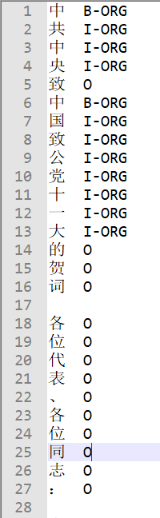

# bilstm-crf-ner
双向长短期记忆网络、条件随机场用于命名实体识别。代码基于python3.7 + tensorflow 1.14实现，<font color=blueviolent>**开箱即用**</font>，含训练数据集和已经训练好的模型文件（离线模型文件需在GPU机器上运行）。

查看本人博客有更详细的原理说明：[自然语言处理：序列标注（BiLSTM-CRF）](https://blog.csdn.net/sinat_34072381/article/details/105869963)

代码实现参考仓库：https://github.com/Determined22/zh-NER-TF

<br>

## 训练模型

训练数据格式参考`data/train.data`格式：



若更换数据集，需重新生成词字典和标签字典文件：`data/word_vocab.pkl` 和 `data/tag_vocab.pkl`。将自定义的训练集放在目录`data/train.data`， 执行以下data_utils.py文件即可。

修改模型文件model.py中的参数：

- 默认RNN网络使用**CuDNNGRU** ，GPU环境的优化版本，没有gpu的机器务必将use_gpu设置为False；

- 其它参数自行调整；

  

执行命令:

```shell
> python model.py train
```

<br>

## 在线预测

执行命令：

```shell
> python model.py
```

<br>

## CRF网络

代码对CRF层官方实现进行了重构，加入了一些理解性的注释，代码实现的精髓：
- sequence_score，对目标序列的分数计算**巧妙地**转换为矩阵运算；

- CrfForwardRnnCell.__call\__，基于动态RNN网络实现对数归一化因子的前向递推动态规划；

- CrfForwardRnnCell.__call\__， **没看懂源码的实现，感觉源码的实现好像不对**，进行了重新实现；


<br>

## 后续工作

阅读源码CRF解码的维特比算法，并写一些理解性注释。